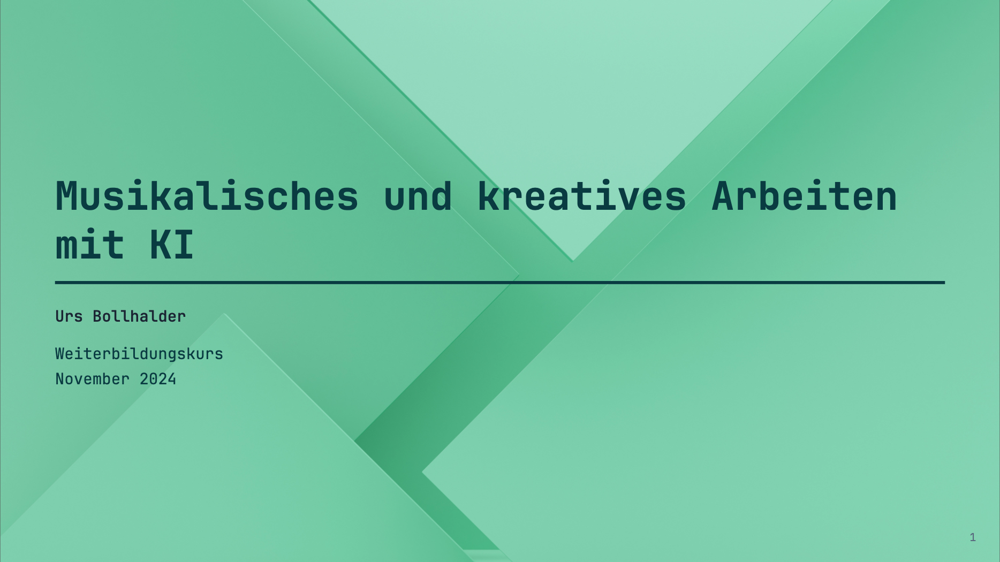

# Musikalisches und kreatives Arbeiten mit KI

Für die Weiterbildung zur Verfügung gestelltes Beispielmaterial

# Tools

**LLMs**

- [Claude AI](https://claude.ai/) ***
- [ΛPERTVS 🇨🇭](https://www.swiss-ai.org/apertus)

**LaTEX / Markdown**

- [Obsidian](https://obsidian.md) ***
- [Overleaf](https://www.overleaf.com/) ***
- [Stack Edit](https://stackedit.io)

**Diagramme / Musiknoten** 

- [Mermaid JS](https://mermaid.js.org)
- [LilyPond](https://lilypond.org)
- [ABC Notation](https://abcnotation.com)

**GenAI Audio**

- [Suno](https://suno.com) ***
- [Udio](https://www.udio.com)
- [ElevenLabs](https://elevenlabs.io)
- [Stable Audio](https://stableaudio.com)
- [Wondercraft](https://www.wondercraft.ai)

**Educational**

- [NotebookLM](https://notebooklm.google)

**Music Scores and Playalongs**

- [MuseScore](https://musescore.com) 
- [iRealPro](https://www.irealpro.com) 

**Stem Splitter**

*Offline Processing*

- [Logic](https://www.apple.com/logic-pro/) 
- [Cubase](https://www.steinberg.net/cubase/new-features/) 
- [FL Studio](https://www.image-line.com)
- [Ableton](https://www.ableton.com/en/blog/live-12-3-is-coming/)
- [Audacity](https://www.audacityteam.org/download/openvino/) 

*Online Processing*
- [Bandlab Splitter](https://www.bandlab.com/splitter) ***
