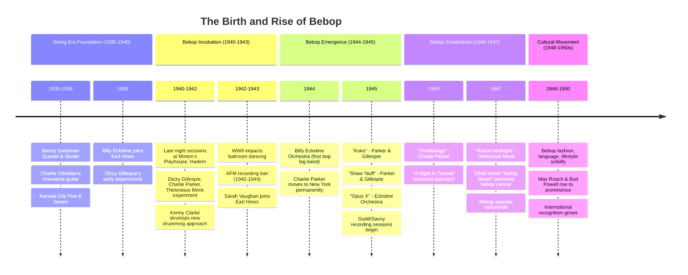
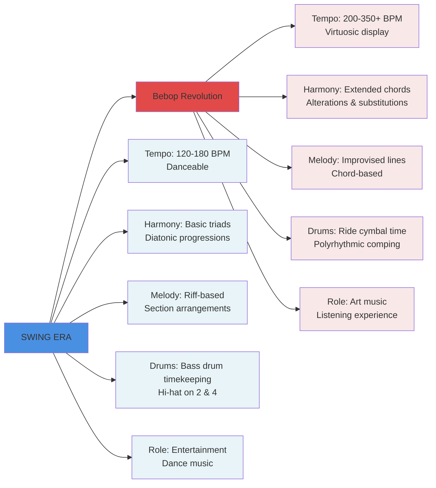

# 🎺 Bebop Land 🎷

### A Revolutionary Journey Through Modern Jazz

---

## The Bebop Revolution

In the smoky after-hours clubs of 1940s Harlem, a musical revolution was brewing. While swing bands kept America dancing through World War II, a small group of virtuoso musicians were dismantling jazz's predictable structures and rebuilding them into something fierce, fast, and unapologetically complex. Bebop didn't just change jazz—it announced that jazz had become an art form demanding the same respect as classical music, played by artists who refused to compromise their vision for popular appeal.

---

## 🕰️ Historical Timeline



### 📖 The Historical Narrative

Bebop emerged from the chrysalis of swing, but it was no gentle metamorphosis. The style germinated in the fertile ground of Kansas City's blues-infused jazz tradition, where young Charlie Parker absorbed the harmonic sophistication of pianists like Art Tatum. As swing orchestras grew commercial and formulaic, innovative musicians felt creatively stifled by written arrangements and dance-floor demands. The jam session became their laboratory—particularly at Minton's Playhouse in Harlem, where house band members Thelonious Monk (piano), Kenny Clarke (drums), and frequent sitters-in like Dizzy Gillespie and Charlie Parker experimented with revolutionary ideas after their regular gigs ended. These musicians developed a musical language so complex and demanding that it functioned as a filtering mechanism, discouraging lesser players from joining their sessions through impossibly fast tempos and harmonic labyrinths.

World War II's impact cannot be overstated: ballroom closures eliminated swing's primary market, while the AFM recording ban (1942-1944) ironically gave bebop time to gestate away from commercial pressures. When recording resumed, bebop burst onto wax fully formed—Parker and Gillespie's 1945 sessions captured lightning in a bottle. The music represented more than technical innovation; it was sonic protest against racial and artistic limitations. As LeRoi Jones noted, bebop carried "a distinct element of social protest... the musicians who played it were loudly outspoken about who they thought they were." These artists dressed sharp in berets and goatees, spoke in hip slang, and demanded to be treated as serious artists, not entertainers. Geographically centered in Harlem and Manhattan's 52nd Street, bebop created an alternative cultural universe where Black intellectual and artistic excellence reigned supreme, influencing everything from poetry to visual arts.

---

## 🎼 Musical DNA: Swing vs. Bebop



---

## 🎹 The Bebop Musical Language

Think of swing as a well-paved highway—comfortable, predictable, designed for smooth travel. Bebop was more like a mountain trail: treacherous, exhilarating, requiring extraordinary skill to navigate. At its harmonic core, bebop musicians extended chords vertically, adding ninths, elevenths, and thirteenths that created a shimmering, dissonant color palette. They mastered **chord substitutions**, particularly the tritone substitution (replacing V7 with bII7), which opened unexpected harmonic doorways. Every dominant chord became an opportunity for alteration—raised and lowered fifths and ninths created tension that demanded resolution. This wasn't random experimentation; bebop players possessed encyclopedic knowledge of chord-scale relationships and voice leading principles.

Melodically, bebop broke from swing's singable, riff-based approach. Lines became angular, unpredictable, often starting and ending on unexpected beats. **Chromatic approach tones**—notes a half-step above or below target chord tones—created the characteristic "bebop sound," a sense of perpetual forward motion through harmonic space. Musicians outlined chord changes explicitly through arpeggiation, yet embellished them with passing tones creating what sounds like spontaneous composition at impossible speeds. The rhythm itself innovated: drummers Kenny Clarke and Max Roach revolutionized their instrument's role, moving timekeeping from the heavy bass drum to a shimmering ride cymbal pattern (_ding-ding-a-ding_), freeing the left hand for spontaneous accents (_comping_) that conversed with soloists.

Bebop's tempo requirements were punishing—often exceeding 300 beats per minute—demanding years of technical development. The rhythm section transformed into an interactive unit: bassists abandoned the two-beat "oom-pah" for _walking bass lines_ that outlined every chord change while maintaining propulsive quarter-note momentum. Pianists developed the art of comping—rhythmically and harmonically unpredictable chord voicings that supported without smothering. Most ingeniously, beboppers created _contrafacts_—new melodies composed over existing song chord progressions, allowing them to avoid paying royalties while demonstrating their compositional prowess. Parker's "Ornithology" was built on "How High the Moon," while "Anthropology" transformed "I Got Rhythm." This practice of reimagining standards wasn't theft but transformation, proving these musicians were composers of the highest order who could spin new gold from familiar materials.

---

## 🎵 Bebop in Practice

### Example 1: Classic II-V-I Progression

Here's a 4-bar phrase demonstrating quintessential bebop language over a II-V-I in Bb major:

```abc
X:1
T:Bebop II-V-I in Bb Major
C:Traditional Bebop Style
M:4/4
L:1/8
Q:1/4=240
K:Bb
%%score (Melody Bass)
V:Melody clef=treble name="Alto Sax"
V:Bass clef=bass name="Bass"
% Bar 1: Cm7
[V:Melody] |:"Cm7"c2 d_e =e2 g2 | 
[V:Bass] |: [C,2E,2G,2] [C,E,G,] [_B,,D,F,] [_A,,C,_E,] [G,,_B,,D,] |
% Bar 2: F7alt
[V:Melody] "F7alt"f2 _e_d c2 _A_B |
[V:Bass] [F,,2A,,2_E,2] [F,,A,,C,] [E,,G,,_B,,] [_E,,_G,,A,,] [D,,F,,_A,,] |
% Bar 3: Bbmaj7
[V:Melody] "Bbmaj7"c_BA_A G2 F2 |
[V:Bass] [_B,,2D,2F,2] [_B,,D,F,] [A,,C,F,] [G,,_B,,E,] [F,,A,,D,] |
% Bar 4: Bbmaj7
[V:Melody] "Bbmaj7"D2 F2 _B4 :|
[V:Bass] [_B,,2D,2F,2] [_B,,D,F,] [_B,,D,F,] [_B,,2D,2F,2] :|
```

**Analysis**: Notice the chromatic approach tones (bar 1: D-Eb-E leading to G), the altered dominant sounds in bar 2, and the enclosure pattern in bar 3 (C-Bb-A-Ab surrounding G). The bass walks steadily in quarters, outlining each chord change.

### Example 2: Signature Bebop Lick

A 2-bar rhythmically displaced phrase showing typical enclosures:

```abc
X:2
T:Bebop Enclosure Lick
M:4/4
L:1/8
Q:1/4=240
K:C
|:"Cmaj7" z2 ^c=d ^d=e g2 |"Cmaj7" e^d=d^c =c2 z2 :|
```

**Key Features**: The lick begins on an upbeat (rhythmic displacement), uses chromatic enclosures (C#-D surrounding E, D#-E surrounding G), and demonstrates the asymmetrical phrasing beboppers favored.

---

## The Pioneers

### Charlie Parker (1920-1955) 🎷

Born in Kansas City, Kansas, Charles Christopher Parker Jr. absorbed the blues-drenched jazz of the Southwest before revolutionizing the art form. His early struggles—including a humiliating incident where drummer Jo Jones threw a cymbal at his feet for poor performance—drove him to obsessive practice, reportedly shedding 11-15 hours daily. Parker's tone was simultaneously lyrical and acidic, his technique so fluid that impossible became routine. Compositions like **"Koko"** (based on "Cherokee"), **"Ornithology"** (on "How High the Moon"), and **"Anthropology"** (on "I Got Rhythm") showcase his genius for melodic invention and harmonic sophistication. His improvisational approach transcended the saxophone—pianists, trumpeters, guitarists all studied Bird's solos note-for-note, recognizing universal principles of line construction and harmonic navigation.

> "Music is your own experience, your thoughts, your wisdom. If you don't live it, it won't come out of your horn." - **Charlie Parker**

Parker's influence extended beyond notes: he proved that a jazz musician could be a composer-improviser of the highest caliber, creating spontaneous art as valid as any written composition. His personal demons—addiction claimed him at age 34—make his achievements even more poignant. Dizzy Gillespie reflected on Parker's impact: _"The music that Charlie Parker created, the style that he created required [a shift from traditional jazz piano], and required new ideas from the drums, and also from the bass. Made guys change their way of doing things."_ Parker's legacy isn't just bebop—it's the entire modern jazz language, a vocabulary every subsequent improviser has studied.

### Dizzy Gillespie (1917-1993) 🎺

John Birks "Dizzy" Gillespie served as bebop's charismatic ambassador, blending volcanic trumpet virtuosity with infectious personality. Where Parker was introspective and troubled, Gillespie was outgoing and organized—a natural leader who formed big bands, mentored younger musicians, and promoted bebop internationally. His trademark bent trumpet bell (accidentally sat on, then kept for its focused sound) and puffed cheeks became visual symbols of the movement. Gillespie's harmonic conception matched Parker's sophistication, but his rhythmic sense leaned Afro-Cuban, pioneering **Latin jazz fusion** with compositions like **"A Night in Tunisia"** and **"Manteca"** (co-written with Chano Pozo). Other classics include the playful **"Salt Peanuts"** and the virtuosic **"Groovin' High."**

> "[Dizzy's] improvisations...was just what he was thinking all that time, and he put it into his playing. And all those intricate changes he would make on his horn...nobody had ever heard anything like this before." - **Cab Calloway**

Beyond performance, Gillespie proved instrumental in bebop's survival and spread. He articulated the music's principles, taught workshops, and maintained that bebop wasn't rejection of jazz tradition but its logical evolution. His big band experiments (1946-1950) attempted to bring bebop complexity to orchestral settings, though financial realities eventually forced him back to small groups. Gillespie's longevity—he performed into his 70s—allowed him to witness bebop's transformation from underground revolution to conservatory curriculum, always emphasizing that the music's demands were intellectual as much as technical.

### Other Essential Voices

**Thelonious Monk (1917-1982)** 🎹  
The high priest of bebop piano, Monk composed angular, harmonically daring pieces that seemed simple yet confounded conventional analysis. His music occupied a unique space—simultaneously primitive and sophisticated, humorous and deadly serious. Compositions like **"Round Midnight,"** **"Straight, No Chaser,"** and **"Blue Monk"** became jazz standards, each demonstrating his gift for memorable melodies built from unexpected intervals. Monk's comping style was equally revolutionary: dissonant, rhythmically unpredictable voicings that challenged soloists to think differently. As he explained: _"Everything I play is different. Different melody, different harmony, different structure. Each piece is different from the other one."_

**Bud Powell (1924-1966)** 🎹  
If Monk was bebop's philosopher, Powell was its virtuoso. He translated Parker's saxophone language to piano, developing right-hand single-note lines of dazzling complexity while his left hand comped spare, rhythmically displaced chords. Recordings like **"Un Poco Loco"** and **"Tempus Fugit"** showcase his ability to navigate changes at Parker-like speeds. Tragically, mental illness and electroshock treatment damaged Powell's abilities, but his prime recordings established the bebop piano vocabulary every subsequent player inherited.

**Kenny Clarke & Max Roach** 🥁  
These drummers revolutionized their instrument's role in jazz. Clarke earned the nickname "Klook" for the onomatopoetic sound of his ride cymbal pattern—the _ding-ding-a-ding_ that became bebop's timekeeper. He moved the steady pulse from bass drum to ride cymbal, freeing his left hand and bass drum for spontaneous "bombs" (accents) that conversed with soloists. Max Roach refined these innovations further, developing melodic approaches to drumming and demonstrating that percussion could carry compositional weight. Both drummers proved essential to bebop's rhythmic liberation from swing's metronomic predictability.

---

## 📚 Essential Bebop Vocabulary

|Term|Definition|
|---|---|
|**Contrafact**|A new melody composed over an existing song's chord progression (e.g., Parker's "Ornithology" on "How High the Moon")|
|**Tritone Substitution**|Replacing a dominant chord (V7) with the dominant chord a tritone away (bII7), creating unexpected harmonic movement|
|**Altered Dominant**|A dominant 7th chord with raised and/or lowered 5ths and 9ths (e.g., G7#5b9), creating maximum tension before resolution|
|**Comping**|Rhythmically and harmonically unpredictable chord accompaniment by piano or guitar that "complements" the soloist|
|**Trading Fours**|Soloists alternating 4-bar improvisations, creating musical conversation (also "trading eights," "trading twos")|
|**Head Arrangement**|An arrangement worked out collectively without written charts, typical of bebop combos|
|**Chromatic Approach Tones**|Notes a half-step above or below a target note, creating the characteristic bebop "surround sound"|
|**Walking Bass**|Steady quarter-note bass line that outlines chord changes while maintaining rhythmic propulsion|
|**Riding**|Keeping time on the ride cymbal with the characteristic "ding-ding-a-ding" pattern|
|**Burning**|Playing at maximum intensity, tempo, and technical difficulty|

---

## 🎧 Essential Listening Guide

### 1. **"Ko-Ko"** - Charlie Parker's Reboppers (1945)

_The bebop declaration of independence._ Built on "Cherokee" changes, this recording moves at breathtaking tempo (≈300 BPM) with Parker and Gillespie trading fierce unison lines. **Listen for**: Parker's solo at 0:52—pure melodic invention at impossible speed, yet every note makes harmonic sense.

### 2. **"A Night in Tunisia"** - Dizzy Gillespie (1946)

_Bebop meets Afro-Cuban rhythms._ Gillespie's composition showcases his harmonic sophistication and rhythmic innovation. **Listen for**: The "Spanish tinge" rhythm in the A section, the explosive trumpet break, and how the piece modulates between sections.

### 3. **"Round Midnight"** - Thelonious Monk (1947)

_Bebop's most recorded composition._ Monk's ballad proves bebop wasn't just about speed but harmonic depth and compositional craft. **Listen for**: The haunting melody's unusual intervals, the ambiguous tonality, and Monk's unique touch and timing.

### 4. **"Ornithology"** - Charlie Parker (1946)

_Contrafact mastery._ Parker's new melody on "How High the Moon" demonstrates how to transform a standard into something entirely new. **Listen for**: How Parker's line flows through the changes, making the familiar progression sound fresh and challenging.

### 5. **"Shaw 'Nuff"** - Charlie Parker & Dizzy Gillespie (1945)

_Partnership perfection._ This original composition showcases both pioneers at their peak, trading lines and pushing each other to greater heights. **Listen for**: The unison head, the harmonic sophistication of the bridge, and the playful interaction.

### 6. **"Un Poco Loco"** - Bud Powell (1951)

_Bebop piano virtuosity._ Powell's signature piece features three incredible takes, each with different interpretations. **Listen for**: Powell's right-hand single-note lines, Afro-Cuban percussion elements, and the composition's delightful asymmetry.

### 7. **"Confirmation"** - Charlie Parker (1953)

_Mature Bird._ Recorded near Parker's death, this shows his artistry at full refinement. **Listen for**: The intervallic leaps in the melody, Parker's relaxed yet intense solo, and how he develops small motivic ideas across his improvisation.

---

## 🌟 Legacy & Lasting Influence

Bebop's explosion in the 1940s sent shockwaves through jazz that continue reverberating today. Within a decade, it spawned _hard bop_ (bebop with blues and gospel intensification), _cool jazz_ (West Coast's cerebral response emphasizing arrangement and restraint), and eventually _modal jazz_ (Miles Davis and John Coltrane's exploration of scales rather than chord progressions). Every modern jazz style—from fusion to free jazz to contemporary mainstream—carries bebop's DNA: the assumption that jazz is art music demanding serious study, that improvisation should demonstrate harmonic knowledge and compositional craft, and that virtuosity serves musical expression.

Modern jazz education would be unthinkable without bebop's codification of harmonic and melodic principles. Every jazz student learns ii-V-I progressions, chord-scale relationships, and bebop vocabulary as fundamental language. The Real Book—jazz's unofficial fake book—consists largely of bebop and bebop-derived compositions. Beyond music, bebop influenced the Beat Generation poets (Kerouac's "spontaneous prose" drew from Parker's improvisation), visual artists, and fashion. The bebop ethos—individual expression within demanding structures, intellectual rigor combined with emotional immediacy, art as both craft and rebellion—resonates across creative disciplines. Most profoundly, bebop established African American musicians as artists and intellectuals, demanding recognition on their own terms rather than as entertainers serving others' needs.

---

## 📖 Further Resources

### Books

- _The Birth of Bebop: A Social and Musical History_ - Scott DeVeaux
- _To Be, or Not to Bop_ - Dizzy Gillespie with Al Fraser
- _Thelonious Monk: The Life and Times of an American Original_ - Robin D.G. Kelley
- _Bird: The Legend of Charlie Parker_ - Robert Reisner (ed.)

### Documentaries

- _Celebrating Bird: The Triumph of Charlie Parker_ (1987)
- _Thelonious Monk: Straight, No Chaser_ (1988)

### Online Resources

- [Carnegie Hall Jazz Timeline](https://timeline.carnegiehall.org/genres/bebop)
- Jazz discographies and analysis at AllMusic.com
- Transcriptions available at JazzStudiesOnline.com

---

_"The music that we were playing wasn't for dancing. It was for listening and understanding."_ - **Dizzy Gillespie**