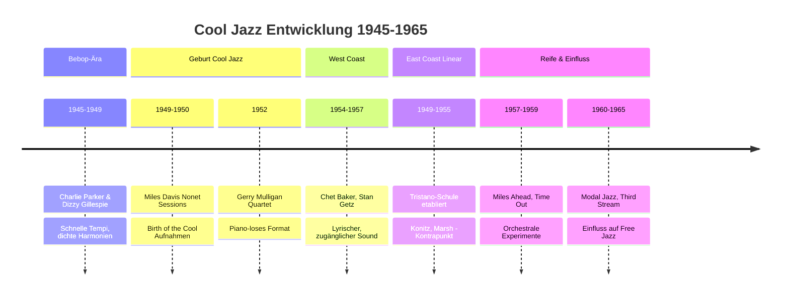
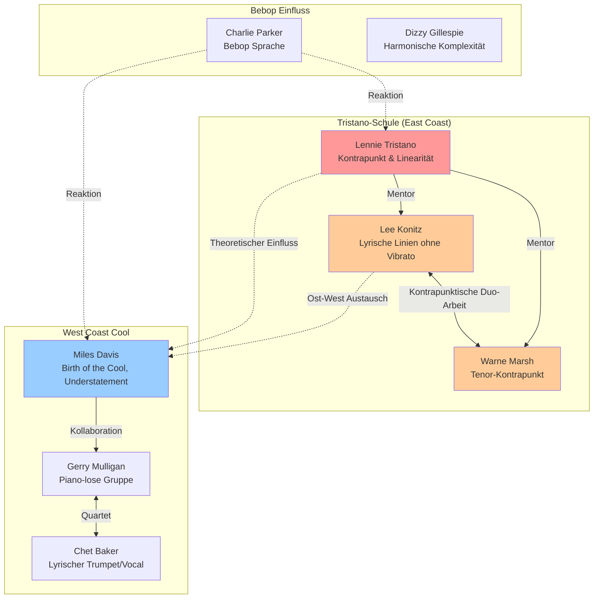

# Cool Jazz - Geschichte und Entwicklung

---

## 1. Cool Jazz Geschichte, Innovation und Entwicklung

Cool Jazz entstand Ende der 1940er Jahre als direkte Reaktion auf die Intensität und Komplexität des Bebop. Während Bebop durch explosive Tempi, dichte Harmonien und virtuose Improvisationen geprägt war, suchten Musiker wie Miles Davis und Lennie Tristano nach einem subtileren, intellektuelleren Ansatz. Der Begriff "cool" selbst stammt aus der afroamerikanischen Kultur und bezeichnete ursprünglich eine Form psychologischer Panzerung – die Fähigkeit, unter Druck Würde, Ruhe und Selbstbeherrschung zu bewahren. Diese Haltung wurde zur musikalischen Ästhetik.

Cool Jazz bevorzugte moderate Tempi, hellere Klangfarben und ausgefeilte Arrangements. Die Musik zog Einflüsse aus der klassischen Musik, insbesondere im Hinblick auf Kontrapunkt und orchestrale Texturen. Viele Cool-Jazz-Aufnahmen integrierten unkonventionelle Instrumente wie Waldhorn, Tuba und Flöte, was dem Genre einen kammermusikalischen Charakter verlieh.

Die Bewegung spaltete sich geografisch: Die Westküste (West Coast Jazz) mit Gerry Mulligan und Chet Baker betonte Zugänglichkeit und lyrische Melodien, während die Ostküste mit der Tristano-Schule einen intellektuelleren, linear-kontrapunktischen Ansatz verfolgte. Miles Davis' "Birth of the Cool"-Sessions (1949-1950) markierten den offiziellen Beginn der Bewegung und etablierten Gil Evans' orchestrale Arrangements als Kernelement des Stils.

Cool Jazz legte den Grundstein für Modal Jazz, Third Stream und Aspekte des Free Jazz. Die Betonung von Raum, Textur und Stimmung beeinflusste spätere Entwicklungen wie ECM Jazz und skandinavischen Jazz. Das Genre erweiterte die Definition von Jazz von Tanzmusik zu Konzertmusik – etwas zum tiefen Zuhören, nicht nur zum Tanzen.

### Entwicklung des Cool Jazz (1945-1965)

[🎨 Diagramm in Mermaid Chart bearbeiten](https://mermaidchart.com/play?utm_source=mermaid_mcp_server&utm_medium=remote_server&utm_campaign=claude#pako:eNp1Us1uGkEMfhWLQ08gJRUkgltICFUbmrQg9dKL2fWyFrMzyONpy1a99VH6JnmxeiGEbEt8m5H9_dk_O1nIqTPqKFfk2NNXD1bK6giuQ3DwHusaJl6_c7Z2ya_gfNgf9M6HF4N9a6RMOXgY0zJseo-_Bff_TT219ocwgusSxTHBA8qaBN7ADdf1FqbsHMUN03HqWCOYZ6Un64AFVRvuQs5ZqQTvUKrgmXxbw5SWSfSou6VkaEoGZ4Y5Y2OEG_zGET4GTwpzitHm42kNYxYtIRSg5VMmV6nwWFYH-j3B4O1hYEoiW5gl53iFHj4lFCU9Df7A6EPPhWiSboNUqG1LXyg2hjBqi6vfmLncxWr6x2iRdmGu2GSg9Wmqu61wzMqms06rxz9-5bh5wjwkn7dpJ3ighTu7CpT_oxwY5MIQtTFge0q2JVJc2pLlFbMfbGdad2GGEkvoNW8V3CS__sf1Z-KC7EYm7AuXYmx5v2zYh8-LvCoJ8y4s7IDhPr3CfC_mNBqZiZz82JBYt1d6iXtxtrvqBjfkuD8ggy1ZcktWCKvT0AeNgKmAWyHaTXZ-_QV2A_kb)

---

## 2. Linear Harmony und kontrapunktische Improvisation

Das zentrale Konzept der Tristano-Schule war die lineare Improvisation, die akkordische Begleitung zugunsten unabhängiger, bewegter Stimmen aufgab. Diese Technik wurzelt in der Tradition des barocken Kontrapunkts von J.S. Bach. Die linke Hand spielt Walking-Bass-Linien, während die rechte Hand frei improvisiert – beide Stimmen sind gleichwertig und horizontal gedacht, nicht vertikal-harmonisch.

Die Intervallstrukturen basieren auf Terzen und Septimen als Guide-Tones, die die Akkordprogression klar darstellen und chromatisch verbunden werden. Diese Guide-Tone-Linien führen natürlich schrittweise, besonders wenn die Akkordprogression im Quintenzirkel fortschreitet. Wichtige harmonische Prinzipien umfassen die Verwendung von Vorhaltsnoten, Durchgangstönen und Appoggiaturen zur Erzeugung polyphoner Texturen.

Nicht-traditionelle Suspensionen (z.B. die b9 des Dominantseptakkords wird in den Moll-Akkord weitergeführt, bevor sie abwärts auflöst) schaffen jazztypische Spannungen. Die melodische Transposition und das freie Wandern zwischen verschiedenen Stimmen (Alt, Tenor, Sopran) erweitern die improvisatorischen Möglichkeiten erheblich.

Tristano vermied bewusst Blues-Inflexionen und Vibrato, um Klarheit und logische Linienführung zu betonen. Dieser Ansatz beeinflusste Generationen von Musikern wie Lee Konitz, Warne Marsh, später auch Bill Evans und Brad Mehldau, und bildete die Grundlage für moderne lineare Improvisationskonzepte. Die mathematische Präzision der Intervallverhältnisse zeigt die analytische Dimension dieser Spielweise.

### Mathematische Intervallstrukturen

Die Intervallverhältnisse in der linearen Harmonik basieren auf reinen Proportionen:

$$
\text{Große Terz} = \frac{5}{4} \approx 386.31\text{ Cent}
$$

$$
\text{Kleine Terz} = \frac{6}{5} \approx 315.64\text{ Cent}
$$

$$
\text{Quinte} = \frac{3}{2} \approx 701.96\text{ Cent}
$$

$$
\text{Große Septime} = \frac{15}{8} \approx 1088.27\text{ Cent}
$$

Die chromatische Verbindung der Guide-Tones erfolgt durch Halbtonschritte, wobei die Septim des einen Akkords zur Terz des nächsten wird:

$$
\text{II}^7 \xrightarrow{\text{7→3}} \text{V}^7 \xrightarrow{\text{7→3}} \text{I}^{\Delta}
$$

Beispiel in C-Dur: $Dm7$ (C→) $\to$ $G7$ (F→) $\to$ $CM7$ (B)

### Musikbeispiel 1: Tristano Guide-Tone Voicings

**Beschreibung:** 4-stimmiger Satz demonstriert die Tristano-Technik mit Walking-Bass in der linken Hand, Guide-Tones (Terzen/Septimen) in mittleren Stimmen und melodischer Linie im Sopran. 

**Progression:** Cm7 – F7 – B♭Maj7 – E♭Maj7 über 4 Takte  
**Tonart:** B♭-Dur, 4/4-Takt  
**Charakteristik:** Stepweise Führung der Guide-Tones, lineare Bass-Bewegung in Viertelnoten, Vermeidung von Akkord-Blöcken zugunsten horizontaler Stimmführung.

*Notationshinweis:* Die Guide-Tone-Linie bewegt sich: C (7 von Cm7) → E (3 von F7) → D (3 von B♭Maj7) → D (7 von E♭Maj7)

### Musikbeispiel 2: Lee Konitz - Lineare Phrasen

**Beschreibung:** 8-taktige Alt-Saxophon-Linie im charakteristischen Konitz-Stil zeigt lange, fließende Achtelnotenlinien ohne Vibrato, chromatische Durchgänge und weite Intervallsprünge.

**Changes:** Dm7 – G7 – CMaj7 – Am7 (2x wiederholt)  
**Tonart:** C-Dur, 4/4-Takt  
**Charakteristik:** Vermeidung von Blues-Tönen, trockener Ton ohne Vibrato, Betonung von chromatischen Approach-Noten, rhythmische Unabhängigkeit vom Metrum. Die Phrasierung arbeitet mit Triolen und verschobenen Akzenten, um eine "über den Takt schwebende" Qualität zu erzeugen.

*Stilmerkmal:* Konitz' Linien bevorzugen schrittweise Bewegung mit gelegentlichen Quartsprüngen, wobei verminderte Skalen für chromatische Annäherung an Akkordtöne genutzt werden.

---

## 3. Wichtige Exponenten des Cool Jazz

### Miles Davis (1926-1991)

Miles Davis war der zentrale Katalysator des Cool Jazz und einer der einflussreichsten Jazzmusiker aller Zeiten. Seine "Birth of the Cool"-Sessions (1949-1950) mit Gil Evans' Arrangements definierten die Ästhetik des Genres: Zurückhaltung, klangliche Raffinesse und orchestrale Texturen mit ungewöhnlichen Instrumenten wie Waldhorn und Tuba. Davis' Spielweise verkörperte die "cool"-Haltung perfekt – ökonomisch, ohne theatralische Gesten, mit einem Fokus auf Raum und Andeutung statt virtuoser Zurschaustellung. Seine späteren Arbeiten wie "Miles Ahead" (1957) erweiterten den Cool Jazz in orchestrale Dimensionen und beeinflussten die Third-Stream-Bewegung. Davis' Fähigkeit zur ständigen Neuerfindung führte ihn später zu Modal Jazz ("Kind of Blue") und darüber hinaus.

### Lennie Tristano (1919-1978)

Lennie Tristano war der intellektuelle Architekt des Cool Jazz und Gründer der einflussreichsten Schule linearer Improvisation. Sein Ansatz basierte auf Kontrapunkt, rhythmischer Unabhängigkeit und einer bewussten Ablehnung von Blues-Inflexionen und Vibrato zugunsten von Klarheit und logischer Linienführung. Tristano war stark von J.S. Bach beeinflusst und übertrug barocke Polyphonie auf Jazz-Improvisation. Seine Aufnahmen wie "C Minor Complex" (The New Tristano, 1962) zeigen unerbittliche Walking-Bass-Linien in der linken Hand bei simultaner komplexer Improvisation rechts. Als Lehrer prägte er Lee Konitz, Warne Marsh und andere, die seine Prinzipien weitertrugen. Tristanos Vermächtnis liegt in der Demonstration, dass Jazz intellektuell rigorose, linear strukturierte Musik sein kann, ohne seine improvisatorische Essenz zu verlieren.

### Lee Konitz (*1927-2020)

Lee Konitz gilt als einer der originellsten Alt-Saxophonisten der Jazzgeschichte. Als Schüler von Lennie Tristano entwickelte er einen unverwechselbaren Stil: trockener Ton ohne Vibrato, lange fließende Linien, die sich mehr an klassischer Musik als an Blues orientierten. Konitz vermied bewusst die Charlie-Parker-Klischees seiner Zeit und schuf eine Alternative zur dominierenden Bebop-Ästhetik. Seine Arbeit auf "Subconscious-Lee" (1950) und seine Kollaborationen mit Warne Marsh zeigen kontrapunktische Duo-Improvisation auf höchstem Niveau. Konitz arbeitete auch mit Miles Davis, Stan Kenton und in späteren Jahrzehnten mit Brad Mehldau, wobei er stets seine lineare, intellektuelle Herangehensweise beibehielt. Seine Karriere erstreckte sich über sieben Jahrzehnte, in denen er die Prinzipien des Cool Jazz konsequent vertrat.

### Warne Marsh (1927-1987)

Warne Marsh war Lee Konitz' kongeniales Gegenstück auf dem Tenor-Saxophon und ebenfalls ein Schüler Tristanos. Sein Spiel zeichnete sich durch trockenen Ton, lange lineare Phrasen und einen fast klassisch anmutenden Mangel an emotionaler Zurschaustellung aus. "Music for Prancing" (1957) zeigt Marsh in Bestform: melodische Logik ohne Aggressivität, swingend ohne jemals laut zu werden. Seine kontrapunktischen Duo-Arbeiten mit Konitz gehören zu den faszinierendsten Beispielen linearer Improvisation im Jazz – zwei unabhängige Stimmen, die sich harmonisch ergänzen, ohne sich gegenseitig zu behindern. Marsh verkörperte die Cool-Jazz-Ästhetik perfekt: Zurückhaltung, intellektuelle Strenge und eine Vorliebe für Subtilität über Showmanship. Seine Musik fordert tiefes Zuhören und belohnt es mit struktureller Komplexität und melodischer Schönheit.

### Einfluss-Netzwerk der Cool Jazz Musiker

[🎨 Diagramm in Mermaid Chart bearbeiten](https://mermaidchart.com/play?utm_source=mermaid_mcp_server&utm_medium=remote_server&utm_campaign=claude#pako:eNqFVO1u0zAUfRUrSBNIpPvdIVVa16lIa8VgZftB0eSkN4tV1ze6thEt4214E16MmzhOkwqGf6T19TnH534kP5IcN5BcJE8kq1KspmsjeFmfhcAUMqy-rJPmV1wrU2hv7Tr5GnD1upW0BWLMVSlJK2gDZ9q9y-h8Eph3Fcm8hAFxrrQGWylg7kwdDvtjJJLfS9qhUZap4gZ3lYbvyv3-5TodMJvw58T3ipR10uDjXV4iar4hRlKOeA3i9bW0TlwhP98MbEUgcxZgDCcUI9HVDRrHt3izdeJMLJQBSUNb9WKUcodGBdpNFFjsKeTEXAVGYGlA3KuMpMOBxlKSLVniQRIjml3UWIFBSntW_luTB7DusUm4VoSYPT9RD26dyW_KMmapuBth13VTkSsFFsKx-5r4Vnw2GyCuj4MdmGEJll5r9SQNa82BaN8Fotytqjui0YKYk6-q4YBMZRwscGFzWkDi3vhdBe78HnOp_1WCMJEiHX0CuXUKzSiddF19AdKk3heKHJGmk-clp4v03Pb2BUDTt3AesKLOo0b02hcGYuYxvaQMlBvQwrOxIwJPa5khzws7fe7KGmBx193y0UtywIpNDfuKrZ109MG6tBmJS8_-PXs5yf-Y2GhVAhK4tgHxm_DXelm318f3RxT8fl-8Kooxrz4gJBZOx-M8L4r-aWsykvN8SG7KNDhNfv4BlGebLQ)

---

## Quellen

- Learn Jazz Standards: "What Is Cool Jazz?" - https://www.learnjazzstandards.com/blog/what-is-cool-jazz/
- Berklee College of Music: "Contrapuntal Improvisation" von Neil Olmstead - https://www.berklee.edu/berklee-today/fall-2003/contrapuntal-improvisation
- Miles Davis: "Birth of the Cool" (Capitol Records, 1957)
- Lennie Tristano: "The New Tristano" (1962)
- Lee Konitz & Lennie Tristano: "Subconscious-Lee" (Prestige Records, 1955)
- Warne Marsh: "Music for Prancing" (Mode Records, 1957)

---

*Diese Broschüre wurde erstellt für Bildungszwecke. Alle musikalischen Analysen basieren auf historischen Aufnahmen und theoretischen Texten.*

